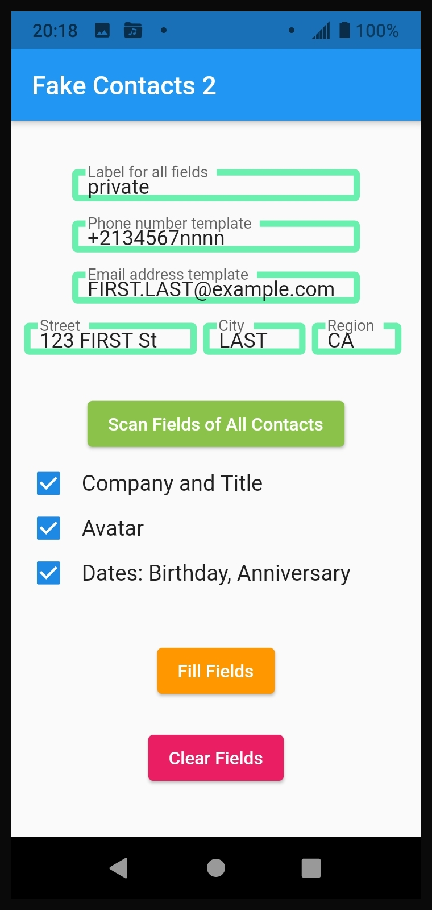

# Fake Contacts 2

Android phone app that puts fake information in certain fields of your phone contacts.  This feeds fake data to any apps or companies who are copying our private data to use or sell it.  This is called "data-poisoning".

[NOT READY YET !!! DO NOT USE !!!]


The app will be available through F-Droid.

This is a sister-application to "Fake Contacts", which creates new fake contacts.  You could use  "Fake Contacts" first to create a lot of fake contacts, then use this app  "Fake Contacts 2" to put fake info in certain fields of ALL contacts, both fake and real.

## Functionality
The user can choose which contact fields to modify, and phone-number and email-address templates for them.  Then click buttons to set or delete fake info into those fields of all contacts.


## Use



The contacts database contains some fields (email, phone, address) which contain labeled values where the LABEL can be a standard value (home, work, other), and some standard fields (name, company, title, avatar).  The first part of this app's page specifies invented values to be put in email/LABEL, phone/LABEL, address/LABEL.  The middle part of this app's page (the check-boxes) specifies which of the standard fields are to be modified.

The default values should be sensible.  But think about your existing real contacts and what fields they use.  You don't want to overwrite any real data with fake data.  Un-check or delete data from fields you don't want modified.

Click the "Fill Selected Fields" button.  The system should ask you to grant Contacts permission to the application.  Then the invented fields for **all** contacts will be set (new email, phone and address values labeled as "LABEL" will be created), and checked fields for **all** contacts will be set.

Launch your usual Contacts app and open any contact to see the new information.  Note: it may take a couple of minutes to update the contacts.

If you wish, click the "Clear Selected Fields" button to delete the checked field and "LABEL" fields from **all** contacts.  Note: it may take a couple of minutes to update the list.  You also could use your normal Contacts app to delete the information manually at any time, without causing any problem.

You could uninstall this app after creating the fake information, without causing any problem.


### Customizing

* The label field is a single value used for LABELs on email addresses, postal addresses, and phone numbers.  You could delete the contents of this field if you wish, and no fake email addresses, postal addresses, and phone numbers will be generated.

I think this field is limited (by the standard Contacts app) to specific lowercase values: home, work, other, mobile, custom.

* The phone-number template is a single value used for all contacts.  Any character "n" in it will be replaced by a digit 0-9, derived from the contact's last name.  The default format is ```+2134567nnnn```, which is intended to use an unassigned country code "21".  You could delete the contents of this field if you wish, and no phone numbers will be generated.

* The email-address template is a single value used for all contacts.  Any string "FIRST" in it will be replaced by the contact's first name.  Any string "LAST" in it will be replaced by the contact's last name.  The default format is ```FIRST.LAST@example.com```, which is intended to be an unused email domain.  You could delete the contents of this field if you wish, and no email addresses will be generated.

* The postal-address template is a triple-value used for all contacts.  Any string "FIRST" in the values will be replaced by the contact's first name.  Any string "LAST" in the values will be replaced by the contact's last name.  The default format is ```123 FIRST St``` ```New York``` ```NY```.  You could delete the contents of any of these fields if you wish, and no postal addresses will be generated.


### Quirks

* The app is designed to be very simple and fail silently.  If you deny permission to access contacts, the app will not complain, it just will not work.  If you click any of the buttons multiple times, you just get the same action each time, with no harm.

* Don't select any fields that have real information for your real contacts.  If you fill/clear those fields, the fields in the real contacts will be affected too.

* Replacements for "n" digits in phone numbers are calculated deterministicly (repeatably) from contact's last name.  So for example if 5 users of this app all just leave everything set at defaults, the same contacts will show up on each of their phones with the same names, phone numbers, and email addresses.  This is good, for data-poisoning purposes.  Further, all fake contacts with same last name will have same phone number (debatable whether this is good or bad).


---


## Releases
### 1.0.0


---

## Development
### To-Do list
* What Android versions are supported ?  I tested on 9; someone else says it works on 9 and crashes on 5.
* Want to explicitly set Notification permission off, but there's no way to do it.
* No UI feedback after create and delete operations.
* Add photos from thispersondoesnotexist.com ?
* Page doesn't scroll if screen is too short.
* Inefficiency in the "save settings after every char changed in field" events.
* Test on iOS.

### Development Environment
I'm no expert on this stuff, this is my first phone app, maybe I'm doing some things stupidly.

Now using:
* Android Studio
* Flutter
* Dart
* Linux
* Phone running Android 9

[F-Droid page for this app](https://fdroid.gitlab.io/fdroid-website/en/packages/me.billdietrich.fake_contacts_2/)

[GitHub repo for this app](https://github.com/BillDietrich/fake_contacts_2)

[My web site](https://www.billdietrich.me/)


---

## Privacy Policy
This application doesn't collect, store or transmit your identity or personal information in any way.  It contains no advertising and no trackers.


## License

See LICENSE.md file.  MIT license.  Copyright 2021 Bill Dietrich.
